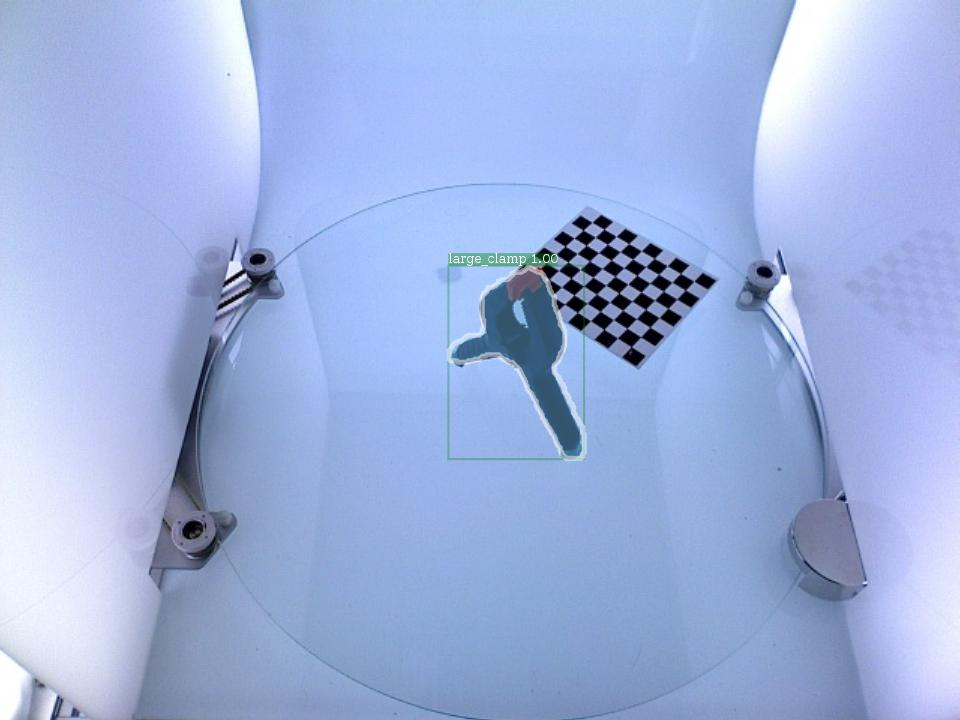
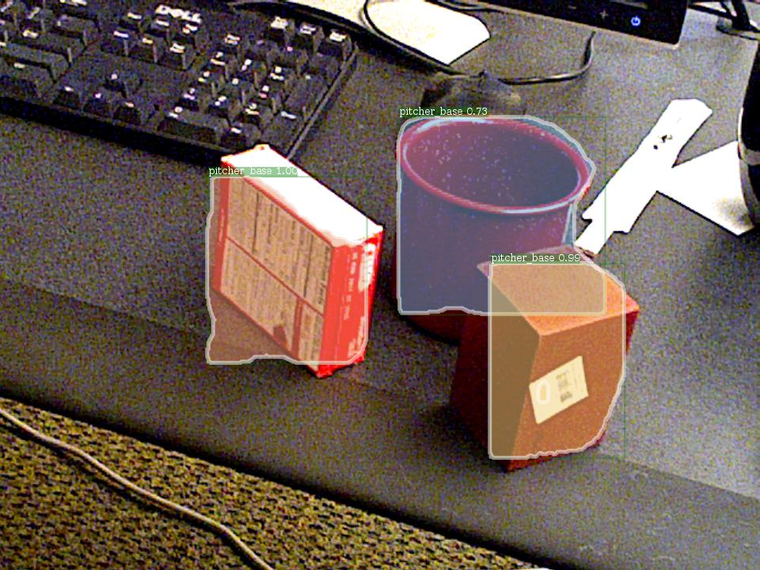

# Mask RCNN on YCB Benchmarks

## Introduction
This project aims to use YCB benchmarks to train a Mask RCNN.
However, this model can only detect well when the images contain only one instance.
To use a model which can detect many instances of the YCB objects in an image, see [Mask_RCNN_on_YCB_Video_Dataset](https://github.com/iyezhiyu/Mask_RCNN_on_YCB_Video_Dataset).

## Image Processing Steps
* ycb_downloader.py: download the RGB-D files of the ycb objects
* ycb_preprocesser.py: crop and resize the images to 480*640 for imitating pictures captured by the commodity RGB-D cameras, without affectting the aspect ratio
* ycb_image_renaming.py: rename the images in order
* ycb_train_val_spliter.py: splite all the images into the training set and the validation set
* ycb_annotation_generator.py: generate annotations as the format of the COCO dataset, with randomizing the image id.
* ycb_pretrain_processer.py: move all the files to the right place

## Files in the [Detectron](https://github.com/iyezhiyu/Detectron) which need to modify:
### $Detectron/detectron/datasets/dataset_catalog.py
in the _DATASETS dictionary, add
```
    'ycb_train': {
            _IM_DIR:
            'path to/ycb_for_train/train',
            _ANN_FN:
            'path to/ycb_for_train/annotations/train.json'
    },
    'ycb_val': {
            _IM_DIR:
            'path to/ycb_for_train/val',
            _ANN_FN:
            'path to/ycb_for_train/annotations/val.json'
    },
```
### $Detectron/detectron/datasets/dummy_datasets.py
modify classes as \_\_background\_\_ and the classes we use
```
    classes = [
        '__background__', 'master_chef_can', 'cracker_box', 'sugar_box',
        'tomato_soup_can', 'mustard_bottle', 'tuna_fish_can', 'pudding_box',
        'gelatin_box', 'potted_meat_can', 'banana', 'pitcher_base',
        'bleach_cleanser', 'bowl', 'mug', 'power_drill', 'wood_block', 'scissors',
        'large_marker', 'large_clamp', 'extra_large_clamp', 'foam_brick'
    ]
```
### Edit the configuration file
such as $Detectron/configs/12_2017_baselines/e2e_mask_rcnn_R-50-FPN_1x.yaml:
* Need to modify:
```
  MODEL:
    NUM_CLASSES: 22 (1 (background) + num of classes)
  TRAIN:
    DATASETS: ('ycb_train',)
  TEST:
    DATASETS: ('ycb_val',)
    FORCE_JSON_DATASET_EVAL: True
 ```
 * Others parameters such as NUM_GPUS, BASE_LR, MAX_ITER, SCALES, MAX_SIZE, etc, can be modified as needed.

## Training Step
```
  python tools/train_net.py \
    --cfg configs/12_2017_baselines/e2e_mask_rcnn_R-50-FPN_1x.yaml \
    OUTPUT_DIR out_dir 
```

## Use the trained model
```
  python tools/infer_simple.py \
    --cfg configs/12_2017_baselines/e2e_mask_rcnn_R-50-FPN_1x.yaml \
    --output-dir path_to_output_dir \
    --image-ext jpg \
    --wts path_to_model \
    path_to_input_images_to_be_detected
```

## Results
* Because the images of the training set all contain only one instance, and the instances are all in the center of the image, also the backgrounds are quite monotonic, so this model can not detect well
* Specifically, my trained model can detect the bounding boxes (the average of precisions is 0.96, the average of recalls is 0.96) and the segmentations (the average of precisions is 0.93, the average of recalls is 0.92) quite well for the images containing only one instance, but not for the categories, such as the images in the images/single_object_1/2/3.jpg
<div align="center">
  
  <p>Single Object Result Example</p>
</div>
* However, if an image contains more than one instance, this model can not do well, such as the image in the images/multi_objects.jpg. The improvement is provided, see [Mask_RCNN_on_YCB_Video_Dataset](https://github.com/iyezhiyu/Mask_RCNN_on_YCB_Video_Dataset).
<div align="center">
  
  <p>Multi Objects Result Example</p>
</div>
